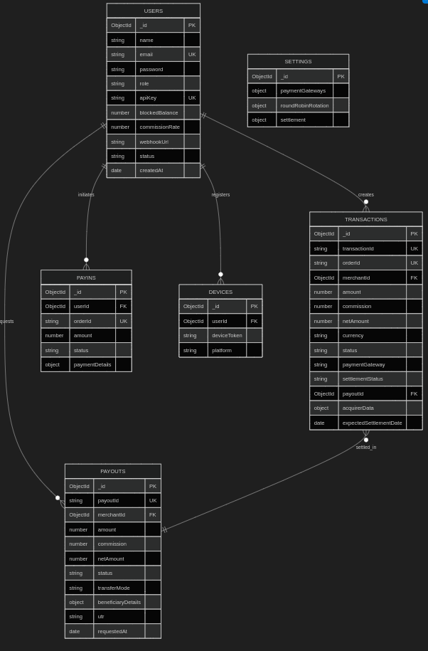
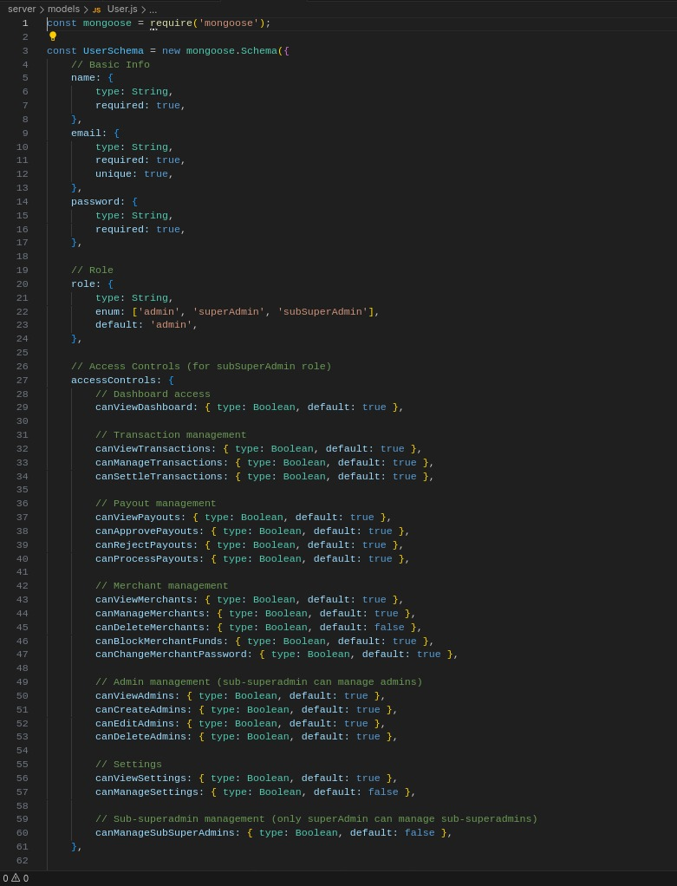
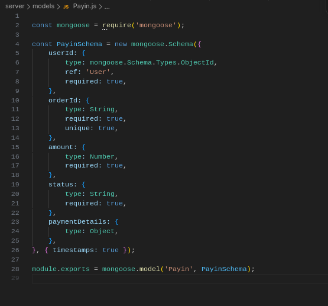
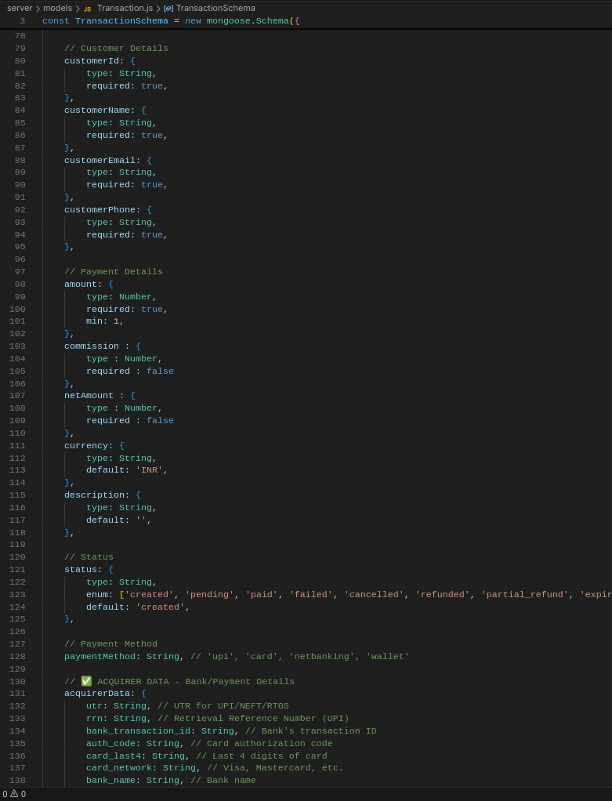
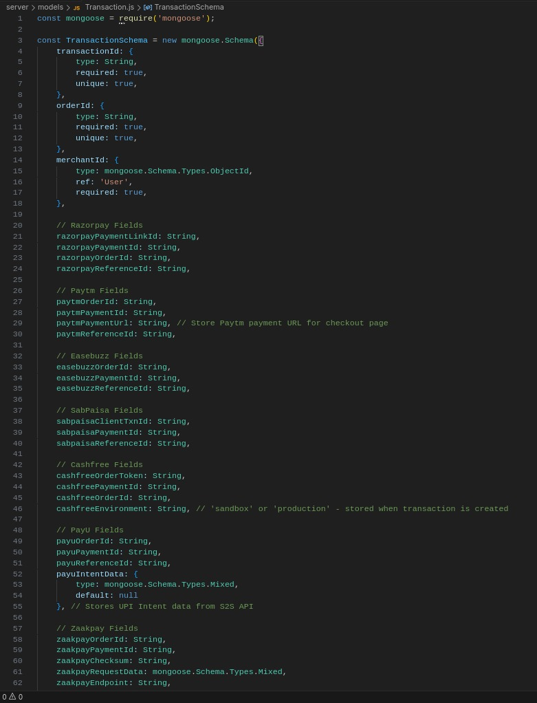

# readme

## Overview

This document outlines the database schema for the payment gateway platform. The system uses MongoDB with Mongoose ODM and consists of 6 main collections that handle user management, transactions, payouts, and platform configuration.

---

## Table Structures

### 1. USERS (Merchant Accounts)

**Purpose**: Stores merchant and admin user accounts with their configurations and access controls.

| Field | Type | Description | Example |
|-------|------|-------------|---------|
| `_id` | ObjectId | Primary key | `507f1f77bcf86cd799439011` |
| `name` | String | User/merchant name | `merchant_123` |
| `email` | String (unique) | Email address | `merchant_123@example.com` |
| `password` | String | Hashed password | `$2b$10$...` |
| `role` | Enum | User role | `admin`, `superAdmin`, `subSuperAdmin` |
| `businessName` | String | Business display name | `Demo Business Ltd` |
| `apiKey` | String (unique) | API authentication key | `sk_live_abc123...` |
| `blockedBalance` | Number | Funds blocked from payout | `5000.00` |
| `commissionRate` | Number | Commission percentage | `2.5` |
| `webhookUrl` | String | Webhook endpoint URL | `https://merchant.com/webhook` |
| `webhookSecret` | String | Webhook signature secret | `whsec_...` |
| `webhookEnabled` | Boolean | Webhook active status | `true` |
| `successUrl` | String | Payment success redirect | `https://merchant.com/success` |
| `failureUrl` | String | Payment failure redirect | `https://merchant.com/failure` |
| `status` | Enum | Account status | `active`, `inactive`, `suspended` |
| `accessControls` | Object | Permission settings | See below |
| `createdAt` | Date | Account creation date | `2026-01-15T10:30:00Z` |

**Access Controls** (for subSuperAdmin):
- `canViewDashboard`, `canViewTransactions`, `canManageTransactions`
- `canViewPayouts`, `canApprovePayouts`, `canProcessPayouts`
- `canViewMerchants`, `canManageMerchants`, `canDeleteMerchants`
- `canViewSettings`, `canManageSettings`

---

### 2. TRANSACTIONS (Ledger Entries)

**Purpose**: Core transaction ledger tracking all payment transactions with multi-gateway support.

| Field | Type | Description | Example |
|-------|------|-------------|---------|
| `_id` | ObjectId | Primary key | `507f1f77bcf86cd799439012` |
| `transactionId` | String (unique) | Internal transaction ID | `TXN_1705315800_ABC123` |
| `orderId` | String (unique) | Merchant order reference | `ORD_2026_001` |
| `merchantId` | ObjectId (FK) | Reference to Users | `507f1f77bcf86cd799439011` |
| `merchantName` | String | Merchant name snapshot | `merchant_123` |
| `amount` | Number | Transaction amount | `1000.00` |
| `commission` | Number | Platform commission | `25.00` |
| `netAmount` | Number | Amount after commission | `975.00` |
| `currency` | String | Currency code | `INR` |
| `status` | Enum | Transaction status | `created`, `pending`, `paid`, `failed`, `refunded` |
| `paymentGateway` | String | Gateway used | `razorpay`, `paytm`, `cashfree`, `payu` |
| `paymentMethod` | String | Payment method | `upi`, `card`, `netbanking`, `wallet` |
| `settlementStatus` | Enum | Settlement state | `unsettled`, `settled`, `on_hold` |
| `settlementDate` | Date | Actual settlement date | `2026-01-16T16:00:00Z` |
| `expectedSettlementDate` | Date | Expected settlement | `2026-01-16T16:20:00Z` |
| `payoutId` | ObjectId (FK) | Reference to Payout | `507f1f77bcf86cd799439013` |
| `payoutStatus` | Enum | Payout state | `unpaid`, `requested`, `paid` |
| `customerName` | String | Customer name | `John Doe` |
| `customerEmail` | String | Customer email | `customer@example.com` |
| `customerPhone` | String | Customer phone | `+919876543210` |
| `customerId` | String | Merchant's customer ID | `CUST_001` |
| `acquirerData` | Object | Bank/payment details | See below |
| `razorpayPaymentId` | String | Razorpay payment ID | `pay_abc123...` |
| `paytmOrderId` | String | Paytm order ID | `PAYTM_ORD_...` |
| `cashfreeOrderId` | String | Cashfree order ID | `CF_ORD_...` |
| `refundAmount` | Number | Refunded amount | `0` or `1000.00` |
| `createdAt` | Date | Transaction created | `2026-01-15T10:30:00Z` |
| `paidAt` | Date | Payment completion | `2026-01-15T10:31:00Z` |

**Acquirer Data** (Bank/Payment Details):
```json
{
  "utr": "123456789012",
  "rrn": "987654321098",
  "vpa": "customer@paytm",
  "bank_transaction_id": "BANK_TXN_123",
  "card_last4": "1234",
  "card_network": "Visa"
}
```

---

### 3. PAYOUTS (Merchant Withdrawals)

**Purpose**: Manages merchant payout requests and settlements to their bank accounts.

| Field | Type | Description | Example |
|-------|------|-------------|---------|
| `_id` | ObjectId | Primary key | `507f1f77bcf86cd799439013` |
| `payoutId` | String (unique) | Payout identifier | `PAYOUT_1705315800_XYZ` |
| `merchantId` | ObjectId (FK) | Reference to Users | `507f1f77bcf86cd799439011` |
| `merchantName` | String | Merchant name | `merchant_123` |
| `amount` | Number | Gross payout amount | `10000.00` |
| `commission` | Number | Payout processing fee | `50.00` |
| `netAmount` | Number | Net amount transferred | `9950.00` |
| `currency` | String | Currency code | `INR` |
| `status` | Enum | Payout status | `requested`, `pending`, `completed`, `failed`, `rejected` |
| `transferMode` | Enum | Transfer method | `bank_transfer`, `upi`, `crypto` |
| `beneficiaryDetails` | Object | Bank account details | See below |
| `utr` | String | Bank UTR number | `HDFC123456789` |
| `commissionType` | Enum | Fee type | `free`, `tier1`, `tier2`, `percentage`, `flat` |
| `requestedAt` | Date | Request timestamp | `2026-01-15T10:00:00Z` |
| `approvedAt` | Date | Approval timestamp | `2026-01-15T11:00:00Z` |
| `processedAt` | Date | Processing timestamp | `2026-01-15T12:00:00Z` |
| `approvedBy` | ObjectId (FK) | Admin who approved | `507f1f77bcf86cd799439014` |
| `rejectionReason` | String | Reason if rejected | `Insufficient balance` |

**Beneficiary Details**:
```json
{
  "accountNumber": "1234567890",
  "ifscCode": "HDFC0001234",
  "accountHolderName": "Merchant Demo",
  "bankName": "HDFC Bank",
  "branchName": "Mumbai Main",
  "upiId": "merchant@paytm"
}
```

---

### 4. PAYINS (Platform Deposits)

**Purpose**: Tracks incoming payments/deposits to the platform.

| Field | Type | Description | Example |
|-------|------|-------------|---------|
| `_id` | ObjectId | Primary key | `507f1f77bcf86cd799439015` |
| `userId` | ObjectId (FK) | Reference to Users | `507f1f77bcf86cd799439011` |
| `orderId` | String (unique) | Order identifier | `PAYIN_ORD_001` |
| `amount` | Number | Payment amount | `5000.00` |
| `status` | String | Payment status | `pending`, `completed`, `failed` |
| `paymentDetails` | Object | Gateway response data | `{}` |
| `createdAt` | Date | Created timestamp | `2026-01-15T10:00:00Z` |

---

### 5. SETTINGS (Platform Configuration)

**Purpose**: Global platform settings for payment gateways and settlement rules.

| Field | Type | Description | Example |
|-------|------|-------------|---------|
| `_id` | ObjectId | Primary key | `507f1f77bcf86cd799439016` |
| `paymentGateways` | Object | Gateway configurations | See below |
| `roundRobinRotation` | Object | Gateway rotation settings | See below |
| `settlement` | Object | Settlement configuration | See below |
| `updatedBy` | ObjectId (FK) | Last updated by admin | `507f1f77bcf86cd799439014` |
| `updatedAt` | Date | Last update time | `2026-01-15T10:00:00Z` |

**Payment Gateways**:
```json
{
  "razorpay": { "enabled": true, "isDefault": false },
  "paytm": { "enabled": true, "isDefault": true },
  "cashfree": { "enabled": true, "isDefault": false },
  "payu": { "enabled": false, "isDefault": false }
}
```

**Round Robin Rotation**:
```json
{
  "enabled": true,
  "lastUsedGatewayIndex": 2,
  "customCounts": { "paytm": 3, "cashfree": 2 }
}
```

**Settlement Configuration**:
```json
{
  "settlementMinutes": 20,
  "settlementDays": 1,
  "skipWeekends": false,
  "cronSchedule": "*/15 * * * 1-6"
}
```

---

### 6. DEVICES (User Devices)

**Purpose**: Stores registered device tokens for push notifications.

| Field | Type | Description | Example |
|-------|------|-------------|---------|
| `_id` | ObjectId | Primary key | `507f1f77bcf86cd799439017` |
| `userId` | ObjectId (FK) | Reference to Users | `507f1f77bcf86cd799439011` |
| `deviceToken` | String | FCM/APNS token | `fcm_token_abc123...` |
| `platform` | String | Device platform | `android`, `ios`, `web` |
| `createdAt` | Date | Registration date | `2026-01-15T10:00:00Z` |

---

## Key Relationships

### 1. Users → Transactions (One-to-Many)
- Each merchant (`Users`) can have multiple transactions
- `Transactions.merchantId` references `Users._id`

### 2. Users → Payouts (One-to-Many)
- Each merchant can request multiple payouts
- `Payouts.merchantId` references `Users._id`

### 3. Transactions → Payouts (Many-to-One)
- Multiple settled transactions can be grouped into one payout
- `Transactions.payoutId` references `Payouts._id`

### 4. Users → Devices (One-to-Many)
- Each user can have multiple registered devices
- `Devices.userId` references `Users._id`

---

## Indexes

### Transactions Collection
```javascript
// Unique indexes
{ transactionId: 1 }  // unique
{ orderId: 1 }        // unique

// Compound indexes for performance
{ merchantId: 1, createdAt: -1 }
{ merchantId: 1, status: 1, settlementStatus: 1 }
{ merchantId: 1, status: 1, createdAt: -1 }
{ merchantId: 1, paymentGateway: 1, createdAt: -1 }
{ "acquirerData.utr": 1 }
```

### Payouts Collection
```javascript
{ payoutId: 1 }  // unique
{ merchantId: 1, status: 1 }
{ merchantId: 1, createdAt: 1, updatedAt: 1 }
```

### Users Collection
```javascript
{ email: 1 }   // unique
{ apiKey: 1 }  // unique, sparse
```

---

## Data Flow Example

### Payment Transaction Flow

1. **Transaction Created**
   ```
   Status: created
   merchantId: merchant_123
   amount: 1000.00
   paymentGateway: paytm (selected via round-robin)
   ```

2. **Payment Completed**
   ```
   Status: paid
   paidAt: 2026-01-15T10:31:00Z
   acquirerData.utr: "123456789012"
   expectedSettlementDate: 2026-01-15T10:51:00Z (20 min later)
   ```

3. **Settlement Processed**
   ```
   settlementStatus: settled
   settlementDate: 2026-01-15T10:51:00Z
   commission: 25.00 (2.5%)
   netAmount: 975.00
   ```

4. **Payout Requested**
   ```
   Payout created with:
   - amount: 10000.00 (multiple transactions)
   - commission: 50.00
   - netAmount: 9950.00
   - status: requested
   ```

5. **Payout Completed**
   ```
   status: completed
   utr: "HDFC123456789"
   processedAt: 2026-01-15T12:00:00Z
   
   Linked transactions updated:
   - payoutStatus: paid
   - payoutId: <payout_id>
   ```

---

## Security & Privacy Notes

> [!IMPORTANT]
> - All sensitive fields (passwords, API keys, webhook secrets) are hashed/encrypted
> - Customer PII (email, phone) should be handled per data protection regulations
> - Bank account details in `beneficiaryDetails` are encrypted at rest
> - API keys use `sk_live_` or `sk_test_` prefixes for environment identification

> [!NOTE]
> - Table names and field names shown here are the actual MongoDB collection and field names
> - Example values use anonymized data (`merchant_123`, `tenant_demo`, etc.)
> - UTR numbers and transaction IDs are masked for security

---

## Summary

This schema supports a multi-tenant payment gateway platform with:
- ✅ Multi-gateway support (Razorpay, Paytm, Cashfree, PayU, etc.)
- ✅ Automated settlement processing (T+20 minutes configurable)
- ✅ Comprehensive payout management with approval workflows
- ✅ Role-based access control (admin, superAdmin, subSuperAdmin)
- ✅ Webhook integration for real-time notifications
- ✅ Detailed transaction tracking with acquirer data (UTR, RRN, VPA)
- ✅ Commission and fee management
- ✅ Round-robin gateway rotation for load distribution











